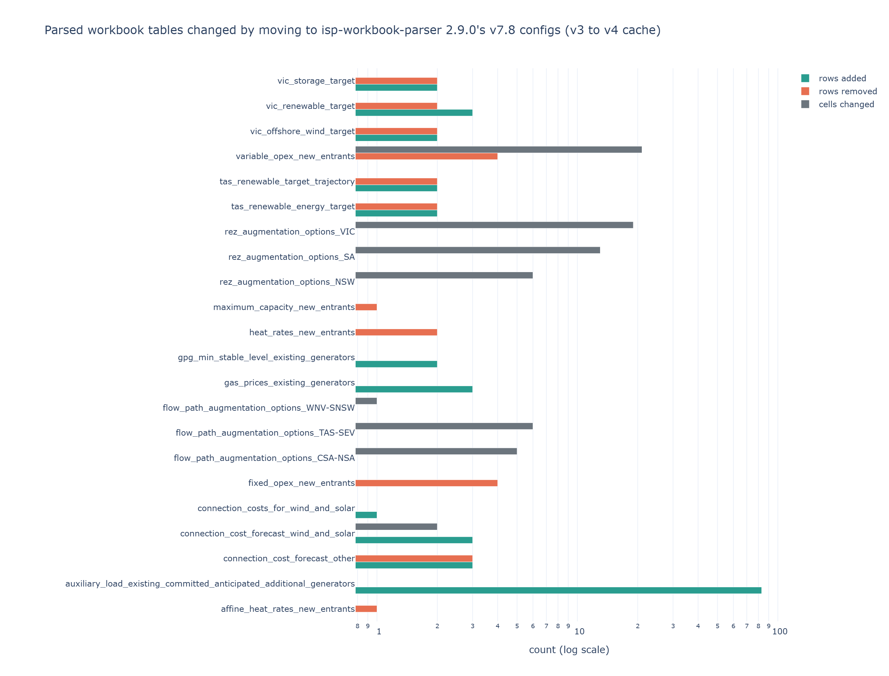

# Workbook parser configuration for the 2026 final IASR workbook

## Purpose and scope

The Inputs, Assumptions and Scenarios Report (IASR) workbook is parsed into `workbook_cache_final/` by `isp-workbook-parser`, driven by
one YAML table configuration per workbook version. The final 2026 workbook reports itself as version 7.8. From `isp-workbook-parser`
2.9.0 the package ships its own 7.8 configurations (S001), so ISPyPSA's cache builder,
[`src/ispypsa/iasr_table_caching/local_cache.py`](../../../src/ispypsa/iasr_table_caching/local_cache.py), uses them directly; only the
7.4 workbook still needs the repository-tracked override under `parser_configs/7.4/`.

This topic records what the two parser configurations read differently, measured on the same workbook: the cache in input package
`2026-09-23T19.42_isp2026_final_v3` was built with a 7.8 configuration cloned from the draft (7.5) layout, and the cache in
`2026-09-25T14.13_isp2026_final_v4` with `isp-workbook-parser` 2.9.0 (S002, S003). The workbook in `iasr/` and the trace store in
`traces/` are the same files in both packages.

## Configuration differences on requested tables

Of the 152 tables `_build_required_tables("7.8")` requests, 20 carry different ranges in the two configurations, and `build_costs`
differs only in a skipped validation check (S003, S004). One more, `gas_and_liquid_fuel_prices_consultant_scenario_mapping`, is absent
from the final workbook and from the 2.9.0 configurations, so the cache builder drops it from the request.

| Table | Draft-derived range | 2.9.0 range | Effect of the draft range |
|---|---|---|---|
| `auxiliary_load_existing_committed_anticipated_additional_generators` | end row 648 | end row 732 | 83 units missing |
| `gas_prices_existing_generators` | end row 126 | end row 129 | 3 Accelerated Transition rows missing |
| `gpg_min_stable_level_existing_generators` | end row 148 | end row 150 | 2 stations missing |
| `initial_resource_limits` | columns B:O | columns B:Q | solar connections-pipeline column and notes missing |
| `connection_costs_for_wind_and_solar` | end row 56 | end row 57 | REZ DN3 missing |
| `connection_cost_forecast_wind_and_solar` | end row 141 | end row 144 | Marulan, Non REZ NSW, Non REZ Victoria missing |
| `connection_cost_forecast_other` | header row 145 | header row 148 | header read 3 rows early: every column unnamed |
| `fixed_opex_new_entrants`, `variable_opex_new_entrants`, `heat_rates_new_entrants`, `affine_heat_rates_new_entrants`, `maximum_capacity_new_entrants` | end rows 28 to 32 | end rows 28 to 31 | footnote rows read as data |
| `tas_renewable_energy_target`, `tas_renewable_target_trajectory`, `vic_renewable_target`, `vic_storage_target`, `vic_offshore_wind_target` | draft header rows | header rows 17 rows further down | draft-position rows read: wrong or empty targets |
| `nsw_roadmap_min_vre_generation_target`, `nsw_roadmap_storage_energy_capacity_trajectory` | columns D:E, D:F | columns D:N, D:J | later financial years missing |
| `existing_committed_anticipated_additional_generator_summary` | end row 732 | end row 734, skipping 733 and 734 | none: same 732 rows |

`isp-workbook-parser` 2.9.0 also strips notes that carry dollar amounts from numeric cells (S001). In v3, cells such as the CSA-NSA flow
path cost read `1749.5$23 million of this amount relates to ...`; in v4 they are the number alone.

## Cached table differences, v3 to v4

[`plot_cache_diff.py`](plot_cache_diff.py) aligns each table's rows on its first column and writes the full comparison to
[`table_diff.csv`](table_diff.csv). 128 of the 153 cached tables are identical; the 25 that differ:

| Table | Rows v3 | Rows v4 | Rows added | Rows removed | Cells changed | Nature |
|---|---:|---:|---:|---:|---:|---|
| `auxiliary_load_existing_committed_anticipated_additional_generators` | 436 | 519 | 83 | 0 | 0 | 57 batteries, 25 wind and solar, 1 hybrid |
| `gas_prices_existing_generators` | 117 | 120 | 3 | 0 | 0 | Accelerated Transition only |
| `gpg_min_stable_level_existing_generators` | 137 | 139 | 2 | 0 | 0 | Dubbo GT, Mugga Lane Renewable Hybrid |
| `connection_costs_for_wind_and_solar` | 49 | 50 | 1 | 0 | 0 | DN3 |
| `connection_cost_forecast_wind_and_solar` | 132 | 135 | 3 | 0 | 2 | Marulan capacity 150 MVA fills in |
| `connection_cost_forecast_other` | 240 | 240 | 3 | 3 | 0 | 34 unnamed columns become named years |
| `initial_resource_limits` | 52 | 52 | 0 | 0 | 0 | 2 columns added |
| `nsw_roadmap_min_vre_generation_target` | 2 | 2 | 0 | 0 | 0 | 9 year columns added |
| `nsw_roadmap_storage_energy_capacity_trajectory` | 2 | 2 | 0 | 0 | 0 | 4 year columns added |
| `tas_renewable_energy_target`, `tas_renewable_target_trajectory` | 2 | 2 | 2 | 2 | 0 | draft rows replaced by 2030 and 2040 targets |
| `vic_renewable_target`, `vic_storage_target`, `vic_offshore_wind_target` | 2 to 3 | 2 to 3 | 2 to 3 | 2 | 0 | draft rows replaced by final targets |
| 5 new-entrant property tables | 22 to 25 | 21 | 0 | 1 to 4 | 0 to 21 | footnote rows dropped; `variable_opex_new_entrants` values turn numeric |
| 3 flow path and 3 REZ augmentation option tables | unchanged | unchanged | 0 | 0 | 1 to 19 | footnote text stripped from costs; values unchanged |

## Effect on templated model inputs

Templating both caches for Step Change at sub-regional granularity with `create_ispypsa_inputs_template` gives identical tables except
four. The rest of the cache differences stop at the cache: auxiliary load is not carried into any templated table, the extra gas rows
are Accelerated Transition only, and the templater reads none of the new REZ resource-limit columns or the state policy tables.

| Templated table | v3 | v4 | Materiality |
|---|---|---|---|
| `new_entrant_generators`, `vom_$/mwh_sent_out` | empty on all 258 rows, so the translator charges 0 | OCGT small 16.30 to 20.42, OCGT large 8.20 to 10.27, CCGT 4.15 to 5.20, CCGT with CCS 8.10 to 10.15, biomass 10.87 to 13.62 A$/MWh; wind and solar 0 | **material**: new gas and biomass plant dispatch cost rises |
| `ecaa_generators`, `minimum_load_mw` | empty for 2 stations | Dubbo Firming Power Station 28 MW, Mugga Lane Renewable Hybrid 3 MW | minor |
| `new_entrant_wind_and_solar_connection_costs` | Marulan empty | Marulan 150 MVA, A$337,836/MW in 2024-25 rising to A$619,261/MW in 2054-55 | minor: one REZ gains a connection cost |
| `renewable_generation_targets` | 4 Tasmanian rows with no value | 15,750 GWh in 2029-30 and 21,000 GWh in 2039-40 | none in the solve: the translator reads no policy target table |

**confidence: high.** Both caches were read from the same workbook and compared cell by cell, and the templated comparison runs the
code the solve runs. The new-entrant VOM gap is traced to the draft range reading footnote rows into `variable_opex_new_entrants`,
which turned its value column into text that the templater's lookup could not use.

## Workarounds kept and removed

| Workaround in `src/ispypsa/iasr_table_caching/` | Still needed with 2.9.0 | Reason |
|---|---|---|
| `parser_configs/7.8/` override | no, deleted | 2.9.0 ships 7.8 configurations |
| `Status5` to `Status` column rename on `maximum_capacity_existing_committed_anticipated_additional_generators` | no, deleted | 2.9.0 parses the header as `Status` |
| Singular `flow_path_augmentation_cost_slower_growth_CNSW-NNSW` request for 7.5 | no, deleted | 2.9.0 names the 7.5 table with the plural |
| Drop `gas_and_liquid_fuel_prices_consultant_scenario_mapping` from the 7.8 request | yes | the table is absent from the final workbook |
| `drop_v78_not_applicable_build_cost_year` | yes | 2.9.0 still parses the 2024-25 build-cost column as the text `Not Applicable` |

**confidence: high.** Each row was checked by parsing the final workbook with 2.9.0 directly.
